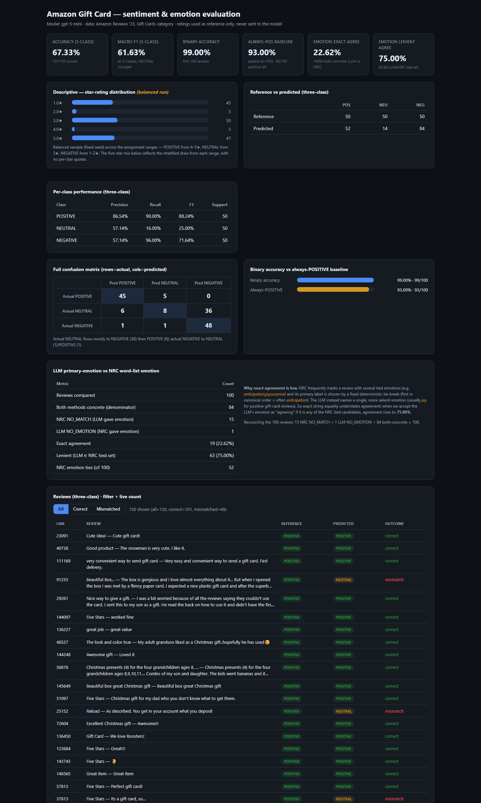

# Assignment 1 MBAX 6418 — Sentiment & Emotion Classification of Amazon Gift-Card Reviews

Workflow driven with an agent (Hermes Agent). Classification and scoring are
written in **Python**; model calls go through an **OpenAI-compatible** endpoint
(`gpt-5-mini`). The structured **`rating` field is withheld**: it is used
**strictly as the reference label** in evaluation code and is **not sent as a
separate model input**. The model's only inputs are the review `title` and
`text`. **Limitation (stated precisely):** withholding the separate rating field
did **not** remove rating *mentions* embedded in the review language itself —
some titles/texts reference stars (e.g. example ① "Only got 3 stars", example ④
titled "Three Stars"). Those in-text rating clues were present in the allowed
inputs and are not attributable to the withheld field.

## Data source (cited)

- **Dataset:** Amazon Reviews '23, *Gift Cards* review category. Collected by
  the **McAuley Lab** at UC San Diego.
- **Dataset site:** https://amazon-reviews-2023.github.io
- **Gift Cards review file (gzipped JSON Lines):**
  `https://mcauleylab.ucsd.edu/public_datasets/data/amazon_2023/raw/review_categories/Gift_Cards.jsonl.gz`

Each line is one review with fields including `rating` (float in {1..5}),
`title`, `text`, `verified_purchase`, `helpful_vote`, `timestamp`, `images`,
`asin`, `parent_asin`, `user_id`. The raw file is large (~152k reviews); it is
re-downloadable and **not** committed to this repository (see `.gitignore`).

## Overview / the four questions

1. **Why did the lopsided run look very accurate, and what did balanced sampling change?**
2. **Which classes get confused with which, and in what direction?** (concrete matrix)
3. **How do the LLM emotions and the word-list emotions differ, and why?**
4. **What bugs / issues came up, and how were they worked around?**

Each is answered in **Results** below with numbers that match the saved output.

## Setup & running

```bash
pip install openai
# create a local .env (gitignored) with: OPENAI_API_KEY=...
# place Gift_Cards.jsonl.gz in the project root, then:
gunzip -k Gift_Cards.jsonl.gz

# 100-review binary first batch
python sentiment_classifier.py --model gpt-5-mini \
    --output gpt5_predictions.csv --sample 100 --pause 7

# Balanced three-class (50 per class, fixed seed) — CORRECTED run
python three_class.py --per-class 50 --model gpt-5-mini \
    --output gpt5_threeclass_v3.csv --pause 7 --seed 6418

# LLM primary-emotion (same 100 binary reviews)
python llm_emotion.py --model gpt-5-mini --pause 7

# NRC word-list scoring (no API calls) and LLM-vs-NRC comparison
python apply_nrc.py
python compare_emotion.py

# Dashboards (self-contained HTML)
python final_dashboard.py                 # main submitted dashboard
python dashboard_generator.py --results gpt5_predictions.csv \
    --settings gpt5_predictions_settings.json --out gpt5_dashboard.html
python three_class_dashboard.py
```

## Files

| File | Purpose |
|---|---|
| `sentiment_classifier.py` | Binary classifier + evaluation + resumable batch engine |
| `three_class.py` | Balanced three-class classification (3-class prompt) |
| `llm_emotion.py` | LLM primary-emotion prediction |
| `nrc_emotion.py`, `apply_nrc.py` | NRC word-list scoring + apply to saved reviews |
| `compare_emotion.py` | LLM-vs-NRC emotion agreement analysis |
| `final_dashboard.py`, `dashboard_generator.py`, `three_class_dashboard.py` | Dashboard generators |
| `gpt5_predictions.csv`, `gpt5_predictions_settings.json` | Binary output + settings/prompt (100 reviews) |
| `gpt5_threeclass_v3.csv`, `gpt5_threeclass_v3_settings.json` | Balanced three-class output + settings/prompt/seed (150, full 1–2/3/4–5 ranges) |
| `gpt5_spotcheck.csv` | Model edge-case spot-check |
| `gpt5_nrc_emotion.csv`, `gpt5_llm_emotion.csv`, `gpt5_llm_emotion_settings.json` | Emotion scores/labels + LLM emotion prompt/settings |
| `gpt5_final_dashboard.html` | Final submitted dashboard |
| `gpt5_dashboard.html`, `gpt5_threeclass_dashboard.html` | Binary / three-class dashboards |
| `screenshots/final_dashboard.png` | Dashboard screenshot (below) |
| `Gift_Cards.jsonl` | Data (gitignored, re-downloadable) |

### Screenshot



## Results

### Step 2 — Binary first-batch (the first 100 reviews in file order)

The first 100 reviews are heavily skewed toward high ratings: **93 positive /
7 negative** reference. So a trivial always-POSITIVE predictor already scores
**93.0%**.

| Metric | Value |
|---|---|
| Prediction coverage | 100% (100/100) |
| **Accuracy** | **99.0%** (99/100) |
| Always-POSITIVE baseline | 93.0% (93/100) |
| Macro-F1 | 95.89% |
| Balanced accuracy | 92.86% |
| POSITIVE prec/rec/F1 (n=93) | 98.94 / 100 / 99.47 |
| NEGATIVE prec/rec/F1 (n=7) | 100 / 85.71 / 92.31 |

**Answer, Q1:** the binary run's 99% accuracy needs context. The
first-100 sample is heavily class-imbalanced — **93 of 100 reviews are POSITIVE**.
A classifier that simply guessed POSITIVE for every review would already score
**93%**, so the model improved on that baseline by **6 percentage points
(99% versus 93%)** — a real but modest gain, not dismissible. It did correctly
classify **6 of the 7 negative reviews**, yet seven examples are too few to
conclude it reliably detects rating-defined negative reviews; one miss stood out
(a 3★ review predicted POSITIVE). When comparing with the balanced run, note
that **both the sample composition and the classification task changed**: the
balanced run introduced **NEUTRAL as a third class** (4–5★ → POSITIVE, 3★ →
NEUTRAL, 1–2★ → NEGATIVE), whereas the binary setup grouped 3★ reviews as
NEGATIVE and never required distinguishing them as NEUTRAL. Because the accuracy
figures are not a controlled comparison of sampling alone, the drop from 99% to
67.3% cannot be attributed to balancing alone.

### Step 6 — Balanced three-class (corrected, full ranges)

Per the assignment split, **4–5 → POSITIVE, 3 → NEUTRAL, 1–2 → NEGATIVE**, with a
balanced sample drawn from the **whole file** using a **fixed seed** and equal
selection opportunity within each class (no per-star-rating quotas). This
corrects an earlier run that had sampled only the extreme ratings **{1★, 3★,
5★}**; the corrected run (v3) samples from the full ranges:

| Class | Pool (whole file) | Drawn from rating(s) |
|---|---|---|
| POSITIVE | 134,940 records | all 4–5★ |
| NEUTRAL | 3,271 records | all 3★ |
| NEGATIVE | 14,199 records | all 1–2★ |

**Selected 150 = 50 per class. Five-star-rating distribution of the sample:
1★=45, 2★=5, 3★=50, 4★=3, 5★=47.** The mix per class reflects the natural
stratified draw (POSITIVE pulled mostly 5★ because 5★ dominates its pool;
NEGATIVE held 45 one★ + 5 two★), not imposed per-star quotas.

| Metric | Value |
|---|---|
| Sample | 150 (50 per class) |
| **Accuracy** | **67.3%** (101/150) |
| **Macro-F1** | **61.63%** (all three classes, NEUTRAL included) |

**Labeled 3×3 confusion matrix (rows = actual, columns = predicted):**

| actual \ predicted | POS | NEU | NEG |
|---|---|---|---|
| **POSITIVE** | 45 | 5 | 0 |
| **NEUTRAL** | 6 | 8 | 36 |
| **NEGATIVE** | 1 | 1 | 48 |

**Per-class:**

| Class | Precision | Recall | F1 | Support |
|---|---|---|---|---|
| POSITIVE | 86.54% | 90.00% | 88.24% | 50 |
| NEUTRAL | 57.14% | 16.00% | 25.00% | 50 |
| NEGATIVE | 57.14% | 96.00% | 71.64% | 50 |

**Answer, Q2 (concrete):** NEUTRAL is the model's weak class. Its errors flow
**overwhelmingly toward NEGATIVE (36 of 50)** — only **8 of 50** 3★ reviews are
labeled NEUTRAL. Direction of confusion is strongly asymmetric: actual NEUTRAL →
predicted NEGATIVE (36); actual NEGATIVE → NEUTRAL (1) and → POSITIVE (1) are
rare. So a ★★★ review is far more likely to be called **negative** than an
actually-negative review is to be called neutral. POSITIVE and NEGATIVE are
nearly always correct (45/50 and 48/50).

**Interpretation:** looking at the example reviews, those
predicted **NEGATIVE** express dissatisfaction directly — e.g. "Never again,"
"very frustrating," "the old way was much easier." The two predicted **NEUTRAL**
sound different: one is matter-of-fact ("They are what they are"), while the
Halloween review mixes praise with disappointment about the ribbon. **These
examples suggest that a 3★ review can still read as negative or mixed**, offering
a possible explanation for *some* of the NEGATIVE predictions. They **do not
establish why all 36** of the 50 were classified NEGATIVE — they illustrate a
plausible cause for part of the pattern, not the full mechanism.

**Answer, Q1 (contrast):** balanced sampling equalizes the three classes (50/50/50),
so a majority-class "predict-all-one-class" strategy caps at **~33%**, and accuracy
drops to **67.3%** versus the lopsided **99%** — exposing the NEUTRAL class that
the imbalanced binary run simply never faced.

### Step 5 — Primary emotion: LLM vs NRC word list *(separate 100-review sample)*

**Note:** the emotion comparison runs on its **own fixed 100-review sample** (the
same first-100 reviews used for the binary Step 2 run), **not** the balanced
150-review three-class sample. Its agreement figures are specific to that 100-review
set and are not the three-class balanced numbers above.

Two independent methods on that **100-review sample**:

1. **LLM** (`gpt-5-mini`, extension prompt) predicts a primary emotion.
2. **NRC Word-Emotion Association Lexicon (EmoLex)** scores each word's
   associations with the eight emotions (anger, anticipation, disgust, fear,
   joy, sadness, surprise, trust) and takes the highest as primary.

**Exact denominator reconciliation (all 100 reviews):**

```
NRC NO_MATCH (LLM gave an emotion)   15
LLM NO_EMOTION (NRC gave an emotion)  1
Both methods concrete (denominator)  84
                                     ---
Total compared                       100
```

| Metric | Count | Rate (of denominator 84) |
|---|---|---|
| **Exact agreement** (LLM label == NRC primary) | 19 | 22.6% |
| **Lenient agreement** (LLM label ∈ NRC tied set) | 63 | 75.0% |
| NRC emotion ties (of all 100) | 52 | — |

**Answer, Q3:** the two methods select the **same primary
label in 19 of 84** comparable reviews (exact agreement **22.6%**), but the LLM
label appears among NRC's **highest-scoring candidates in 63 of 84** (lenient
agreement **75.0%**). Allowing any tied candidate to count as a match therefore
adds **44 matches** — showing that **NRC's tie-breaking rule substantially affects
the comparison**. The methods disagree more about *which emotion to select as
primary* than the exact-match figure alone suggests. **However**, 75% is **not
"almost always,"** and accepting multiple candidates makes agreement easier: it
does **not** prove either method *correctly* identifies the emotion, and the two
still disagree under this broader comparison in **21 of 84** reviews (84 − 63).

It is also important to state how each method works without overclaiming: **NRC
counts word→emotion associations** from the lexicon to score a review, while the
**LLM predicts a primary emotion from the review language**. We have **not**
established that the LLM counts emotions, nor that it selects a "more salient"
one; those are not supported by our data. What the counts do show is that the
difference in their primary-label choices is largely tied to NRC's deterministic
tie-break.

### Source & acquisition of the NRC lexicon

- **NRC Word-Emotion Association Lexicon (EmoLex), v0.92**, NRC Canada
  (Mohammad & Turney, 2013 — *Crowdsourcing a Word-Emotion Association
  Lexicon*, Computational Intelligence 29(3):436–465). Non-commercial /
  research & educational use; cite the 2013 paper.
- **Home page:** https://saifmohammad.com/WebPages/NRC-Emotion-Lexicon.htm
- **Acquisition:** download
  `https://saifmohammad.com/WebDocs/Lexicons/NRC-Emotion-Lexicon.zip`, unzip,
  and use `NRC-Emotion-Lexicon-Wordlevel-v0.92.txt`. The archive is **not**
  committed here (it is re-downloadable); `nrc_emotion.py` / `apply_nrc.py`
  consume the unzipped word-level file. See the lexicon's own terms of use.

## Answer to Q4 — bugs & issues hit, and workarounds

The **three-class prompt bug was the most consequential**: it prevented the model
from ever selecting NEUTRAL, so an implementation error initially looked like a
model weakness. Publishing that result would have misrepresented what we actually
tested. The sampling and metric bugs also mattered: excluding 2★/4★ reviews
changed the intended sample, dropping NEUTRAL from macro-F1 overstated
performance, and the emotion-label capitalization mismatch produced an artificial
disagreement that disappeared once label formats were normalized.

- **Daily RPD rate limit (gpt-4o-mini).** Requests returned HTTP 429 with the
  model briefly reporting its daily request quota exhausted
  (`429`, `x-ratelimit-reset-requests ≈ 26h`). This is reported as an observed
  provider error; we did **not** verify an account-level cause. Workaround:
  switched to **`gpt-5-mini`** (a separate quota) in a **distinct experiment**
  (`gpt5_*` files); the two models' results are never mixed.
- **Three-class prompt never sent (implementation bug in `three_class.py`).** The
  initial `three_class.py` defined a 3-class prompt but routed through the
  **binary** classifier (`classify_review`), which hard-codes the binary system
  prompt — so **zero NEUTRAL** predictions resulted. This was an **implementation
  error, not a model finding**. Fixed by sending the 3-class prompt explicitly,
  yielding the corrected output.
- **Balanced sampling sampled the wrong ratings (fix on top of the above).** The
  corrected prompt was first run on extreme ratings **{1★, 3★, 5★}** (50 each)
  instead of the assignment's **1–2 / 3 / 4–5 ranges**. Corrected to sample from
  the full ranges with a fixed seed (see Step 6). Both pre-corrected runs are
  **superseded and excluded** from this repository; only the full-range v3 is
  committed.
- **Macro-F1 dropped the NEUTRAL class.** The earliest summary reported 75.45% by
  averaging only the two easy classes (dropping NEUTRAL). Correcting that *on the
  same run's predictions* yields **50.30%**. The final **61.63%** is **not** a
  recalculation of that run — it comes from a **different run** using the
  corrected prompt and the full rating ranges (v3). The two numbers must not be
  conflated.
- **Transient connection errors dropped reviews.** One three-class run hit
  `APIConnectionError`s and lost 12 NEGATIVE rows. Fixed with (a) bounded
  retries on transient errors and (b) a **resume path** that reloads the saved
  ledger and completes only unfinished reviews — no duplicate calls.
- **Emotion comparison case mismatch hid agreement.** NRC stores lowercase
  (`joy`), LLM uppercase (`JOY`); a naive string comparison reported 0% agreement.
  Normalizing the label format → true 19/84 exact (the mismatch was artificial).
- **Invalidated API key mid-run.** Calls returned HTTP 401 (`token_invalidated`).
  Stopped immediately (no repeated retries), diagnosed from saved diagnostics, and
  resumed only after a fresh key was saved to `.env`.
- **Attempts ledger header bug.** A fresh-run attempt file could be written
  without its header row, so a CSV rebuild found zero rows even after a
  successful run. Fixed the header-writing guard; the completed v3 data was
  recovered and verified from the intact ledger (no re-calling).

Rate-limit, authentication, and interruption issues mainly delayed completion;
reliable saving and resume handling were what prevented incomplete results from
being reported as complete.

## Evaluation & reproducibility notes

- **Reproducibility:** the **fixed random seed (6418)** reproduces the same
  **selected reviews** each run, and the **saved predictions** in
  `gpt5_threeclass_v3.csv` reproduce the reported metrics. Fresh model calls are
  **not guaranteed** to return byte-identical predictions, so regenerating by
  re-calling the model may not give exactly the numbers reported here.
- **The rating field is withheld, not erased.** The structured `rating` field is
  used only in evaluation (reference labels) and is **not** sent as a model input;
  reference labels are computed only in evaluation code. However, in-text rating
  mentions (e.g., "3 stars", "Five Stars") that appeared in review titles/texts
  were not stripped, so they remained visible to the model.
- **Undefined metrics are labeled** (precision/recall shown as "N/A (undefined)"
  when the denominator is zero), and a present class with zero correct
  predictions still gets F1 = 0 and is included in macro-F1.
- **Coverage vs eligibility are reported separately.**
- Every number in this README matches the saved output files listed above.
